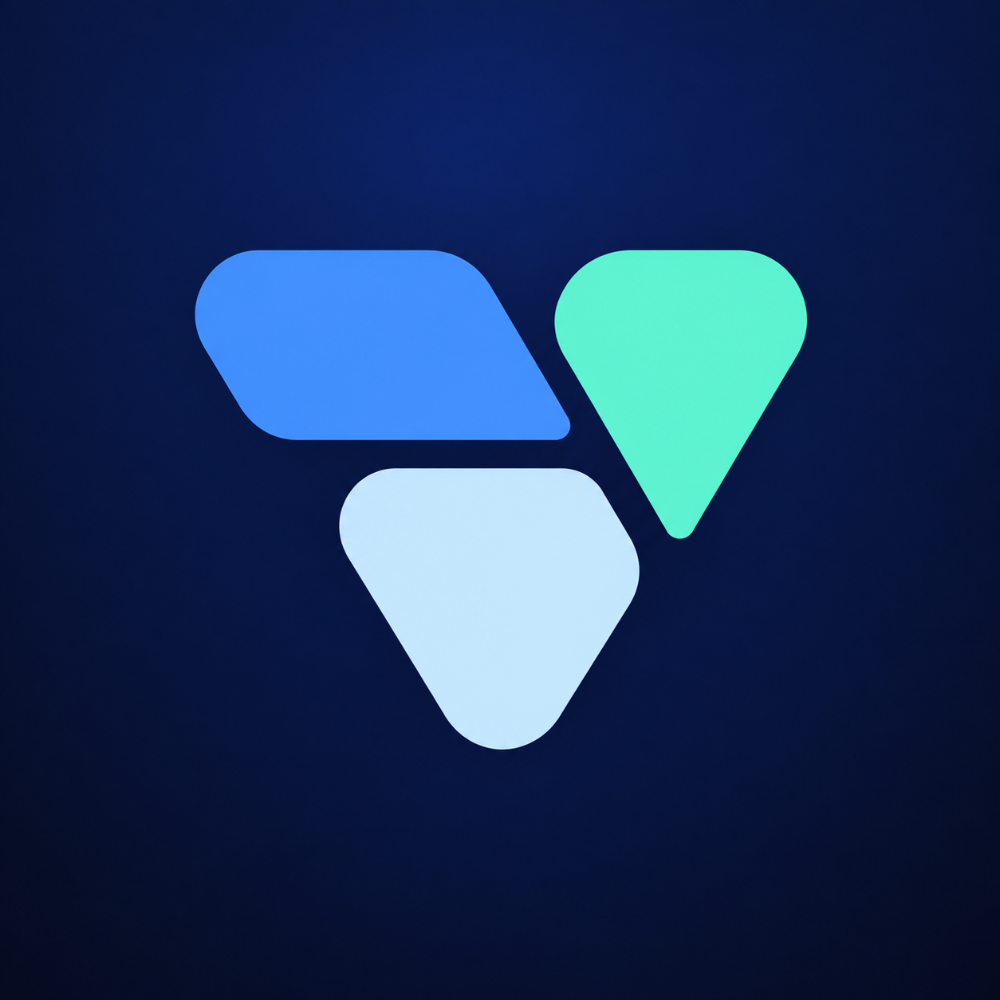
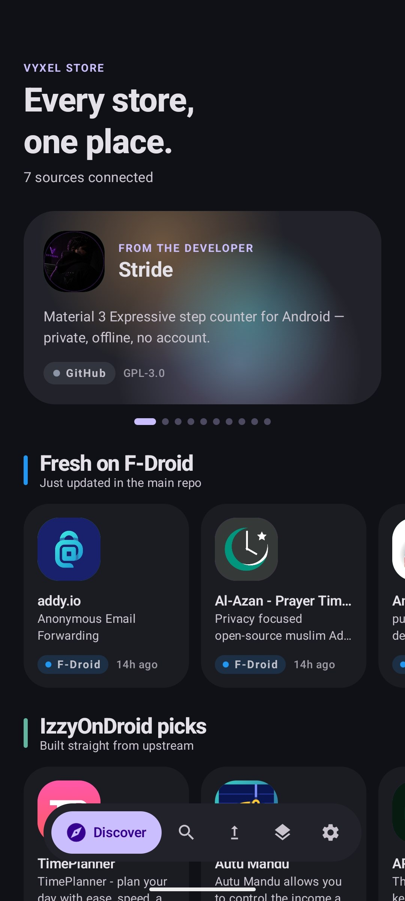
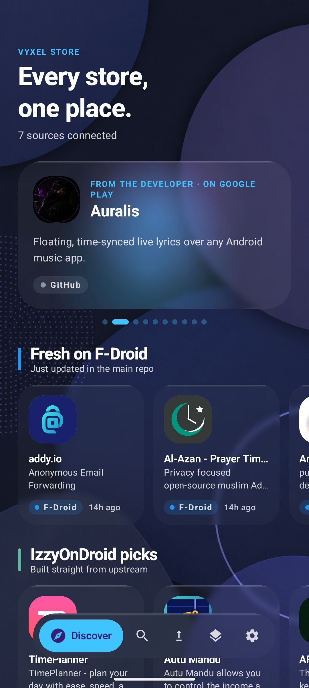
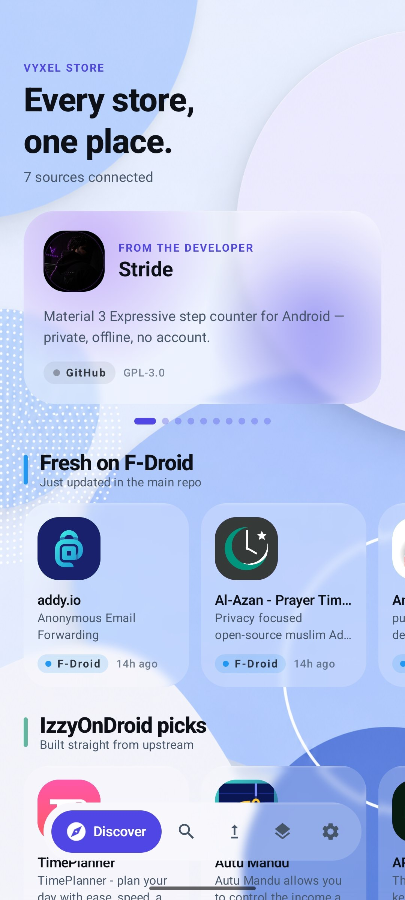
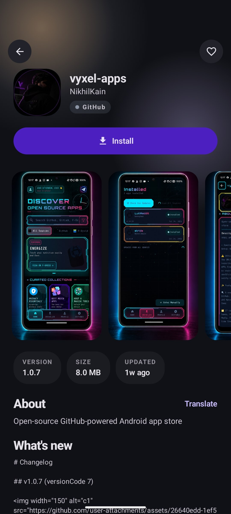
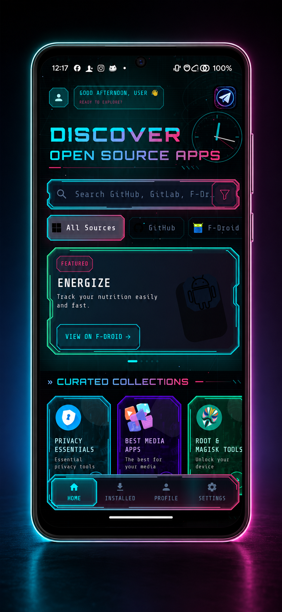
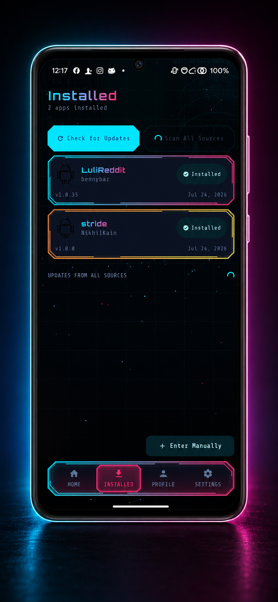
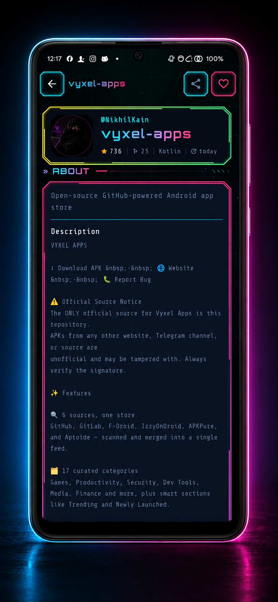
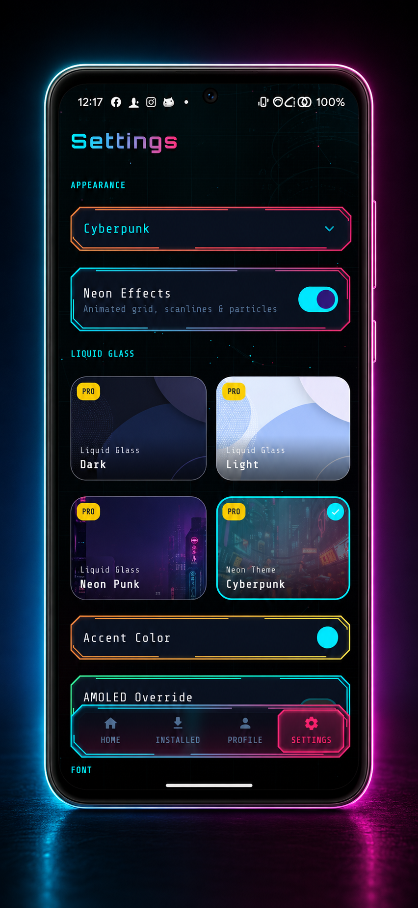

<a id="top"></a>
<div align="center">



# VYXEL APPS


[](LICENSE)
[](https://github.com/NikhilKain/vyxel-apps/releases)
[](https://github.com/NikhilKain/vyxel-apps/stargazers)
[](https://kotlinlang.org)
[](#)

[**⬇ Download APK**](https://github.com/NikhilKain/vyxel-apps/releases/latest) &nbsp;·&nbsp; [**🌐 Website**](https://NikhilKain.github.io/vyxel-apps/) &nbsp;·&nbsp; [**🐛 Report Bug**](https://github.com/NikhilKain/vyxel-apps/issues)

<br/>

[](#features)
[](#liquid-glass-pro)
[](#screenshots)
[](#installation)
[](#tech-stack)
[](#support)

</div>

---

> ⚠️ **Official Source Notice**
> The ONLY official source for Vyxel Apps is this repository.
> APKs from any other website, Telegram channel, or source are
> unofficial and may be tampered with. Always verify the signature.

<a id="features"></a>
## ✨ Features

<table>
<tr>
<td width="50%" valign="top">

**🔍 14 sources, one store**
GitHub, GitLab, Codeberg, F-Droid, IzzyOnDroid, Aptoide, Aurora OSS, APKPure, Flathub and WinGet, plus four root-module repositories — scanned and merged into a single feed.

**🗂 17 curated categories**
Games, Productivity, Security, Dev Tools, Media, Finance and more, plus smart sections like Trending and Newly Launched.

**🛡 Signature verification**
Every downloaded APK is checked against the installed app's signing certificate before install — a hijacked repo or redirected release can't silently overwrite what's on your phone.

**🥷 Silent installs via Shizuku**
Skip the system install confirmation screen entirely when Shizuku is running.

**🛡 Trust Score system**
0–100 score based on stars, activity, releases, and forks.

**🔔 Background update monitoring**
WorkManager checks installed apps against all six sources and notifies you of updates.

</td>
<td width="50%" valign="top">

**📱 Home screen widget**
App of the Day plus your pending update count, refreshed every 30 minutes.

**⚖️ App comparison mode**
Compare two apps side-by-side.

**📸 Auto-extracted screenshots**
Pulled straight from each repo's README.

**🔄 Install history & rollback**
Roll back to a previous version straight from your install history.

**⭐ GitHub starred repos sync**
Sync your stars into favourites.

**🌍 16 languages**
English, Hindi, Spanish, French, German, Japanese, Portuguese, Italian, Russian, Chinese, Korean, Arabic, Dutch, Turkish, Polish, Swedish.

**📢 In-app announcements**
Dismissible banners for giveaways, releases, and community updates.

</td>
</tr>
</table>

<a id="open-core"></a>
## 🧩 Open core

Vyxel Apps is **open core**. Everything that makes it an app store is open source under
AGPL-3.0; a small optional visual pack is not.

<table>
<tr>
<td width="50%" valign="top">

**✅ Open source**

- All 14 sources and the search, ranking and merge engine
- Downloads, signature verification, Shizuku installs
- Update scanning, rollback and install history
- The Modules screen (Magisk, Zygisk, LSPosed, KernelSU)
- Both interfaces — Classic and Expressive
- Trust Score, comparison, backup/restore
- 16 languages

</td>
<td width="50%" valign="top">

**💎 Paid build only**

- The four **Liquid Glass Pro** themes and their real-time blur rendering
- The licence verification and entitlement service

</td>
</tr>
</table>

No feature that affects finding, installing, updating or removing an app is behind the
paywall. The paid part is cosmetic, and it is what funds the rest.

Source for the open core is published per release: **[`opencore-vyxel-v1.1.0`](https://github.com/NikhilKain/vyxel-apps/releases/latest)**.

<a id="liquid-glass-pro"></a>
## 💎 Liquid Glass Pro <sub>(optional)</sub>

<table>
<tr><td>

Four premium themes — **Liquid Glass Dark**, **Liquid Glass Light**, **Neon Punk**, and **Cyberpunk** *(the one you're looking at right now)* — built on real-time backdrop blur, all unlocked with a single license key. A free 30-second preview is available before you buy.

The app is fully usable without it — see [Open core](#open-core) above for exactly what is and isn't included.

<div align="center">

[](https://narzo7.gumroad.com/l/suayy)

</div>

</td></tr>
</table>

<a id="screenshots"></a>
## 📱 Screenshots

<div align="center">

   

*Home ·*

   

*Home · Apps · Profile · Settings*

   

*Home · Apps · Profile · Settings*

   

</div>

<a id="installation"></a>
## 📥 Installation

1. Download the latest APK from [Releases](https://github.com/NikhilKain/vyxel-apps/releases/latest)
2. On your Android device: **Settings → Apps → Special access → Install unknown apps** → enable for your browser/file manager
3. Tap the downloaded APK to install

> 💡 Optional: install [Shizuku](https://shizuku.rikka.app/) for silent, confirmation-free installs of every app you update through Vyxel Apps.

<details>
<summary><b>🔧 Building from Source</b></summary>
<br/>

```bash
git clone https://github.com/NikhilKain/vyxel-apps.git
cd vyxel-apps
```

Open the project in Android Studio (JDK 17, compileSdk 37, targetSdk 36, minSdk 26). It will build and run out of the box — the following `local.properties` keys are all **optional** and only needed to reproduce specific production behavior:

| Key | Purpose | If omitted |
|---|---|---|
| `signing.storeFile` / `storePassword` / `keyAlias` / `keyPassword` | Release signing | Unsigned release APK |
| `gumroad.product.id` | Liquid Glass Pro license verification | Verification disabled — Pro themes stay locked |
| `lg.hmac.secret` / `lg.script.url` | Liquid Glass license signing endpoint | N/A in forks |

Everything else — the six-source scanner, Trust Score, comparison mode, widget, and free themes — works fully without any secrets configured.

</details>

<a id="tech-stack"></a>
## 🛠 Tech Stack

<div align="center">


</div>

- [Kotlin](https://kotlinlang.org/) + [Jetpack Compose](https://developer.android.com/jetpack/compose) + [Material 3](https://m3.material.io/)
- [Retrofit](https://square.github.io/retrofit/) + [OkHttp](https://square.github.io/okhttp/) — GitHub / GitLab / F-Droid / IzzyOnDroid / APKPure / Aptoide clients
- [Coil](https://coil-kt.github.io/coil/) — image loading
- [WorkManager](https://developer.android.com/topic/libraries/architecture/workmanager) — background update checks
- [Shizuku](https://shizuku.rikka.app/) — silent installs without root
- [AndroidX Security Crypto](https://developer.android.com/jetpack/androidx/releases/security) — encrypted storage for tokens and license keys
- [Backdrop](https://github.com/Kyant0/Backdrop) — real-time blur for the Liquid Glass Pro themes

<a id="contributing"></a>
## 🤝 Contributing

Contributions are welcome! Open an issue first to discuss what you'd like to change.

1. Fork the repo
2. Create a feature branch (`git checkout -b feature/cool-thing`)
3. Commit your changes (`git commit -m 'Add cool thing'`)
4. Push to the branch (`git push origin feature/cool-thing`)
5. Open a Pull Request

<a id="support"></a>
## 💖 Support

If Vyxel Apps is useful to you:
- ⭐ Star this repo
- 💎 Grab [Liquid Glass Pro](https://narzo7.gumroad.com/l/suayy) — it's the main thing that funds ongoing development
- 🐦 Share with your friends
- 🐛 Report bugs in [Issues](https://github.com/NikhilKain/vyxel-apps/issues)
- 📝 Send feedback via the in-app feedback button

**App Support:** https://t.me/vyxelapps/1

### ☕ Buy Me a Coffee

Hey! 👋 I'm Nikhil, an indie Android developer building this project in my free time — making apps from GitHub, GitLab, F-Droid, and other developer-first sources easier to discover, install, and manage on Android, while keeping everything open, fast, and user-friendly.

Every contribution goes directly toward new features, bug fixes, performance improvements, and long-term development.

<div align="center">

[](https://narzo7.gumroad.com/l/nhlevz)

*Thank you for supporting independent open-source development ❤️*

</div>

## 📄 License

[](LICENSE)

<br/>

<div align="center">


Built with ❤️ for the open-source community.

[⬆ Back to top](#top)

</div>
